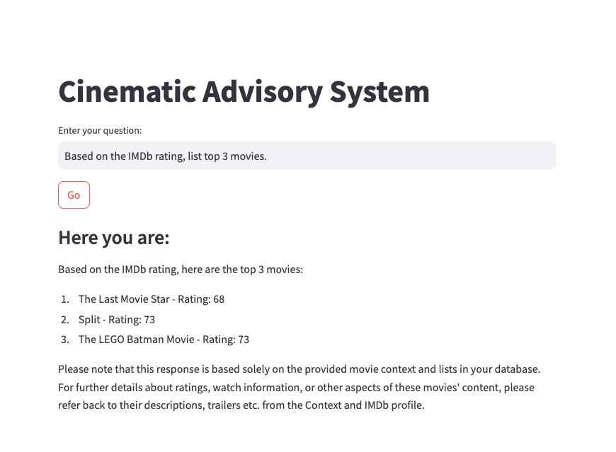

# llm-zoomcamp-project

## Introduction

This project leverages Retrieval-Augmented Generation (RAG) to develop a movie consultation system capable of answering questions by retrieving relevant information from a movie dataset hosted on data.world (https://data.world/iliketurtles/movie-dataset).

## Project Details

- Dataset: [data/data-500.csv](https://data.world/iliketurtles/movie-dataset)
- LLM: [Gemma2 2b](https://ollama.com/library/gemma2)
- Embedding model: [multi-qa-MiniLM-L6-cos-v1](https://huggingface.co/sentence-transformers/multi-qa-MiniLM-L6-cos-v1)
- Database: ElasticSearch 
 
## Ingestion

- Adapt an in-memory database, minsearch, as the knowledge base. 
- Refer to [evaluation-data.ipynb](./notebooks/evaluation-data.ipynb)

## Retrieval Evaluation

- Implement `hit_rate` & `mrr` to assess the quality of the retrieval operations.

## RAG Evaluation

- Apply the LLM-as-a-Judge metric to evaluate the quality of the RAG flow. Using gpt-40-mini with a sample of 300 records, the results were:
    - 264 (88%) `RELEVANT`
    - 20 (7%) `PARTLY_RELEVANT`
    - 15 (5%) `NON_RELEVANT`
- Refer to [rag-test.ipynb](./notebooks/rag-test.ipynb)

## Prerequisites

- Python 3.10 or higher
- Docker

## Setup Instructions

1. Set up a Python virtual environment and install the required dependencies using `pip install -r requirements.txt`.

2. Start the Docker containers by running `./start.sh`. This script will initialize the `ollama` and `elasticsearch` containers, download the necessary model into the `ollama` container, and execute the `data_init.py` script to load data into `elasticsearch`.

3. Launch the client application by running `./run_client.sh`. You can then begin asking questions to the movie consultant! Or refer to [hybrid_search.ipynb](./notebooks/hybrid_search.ipynb)

